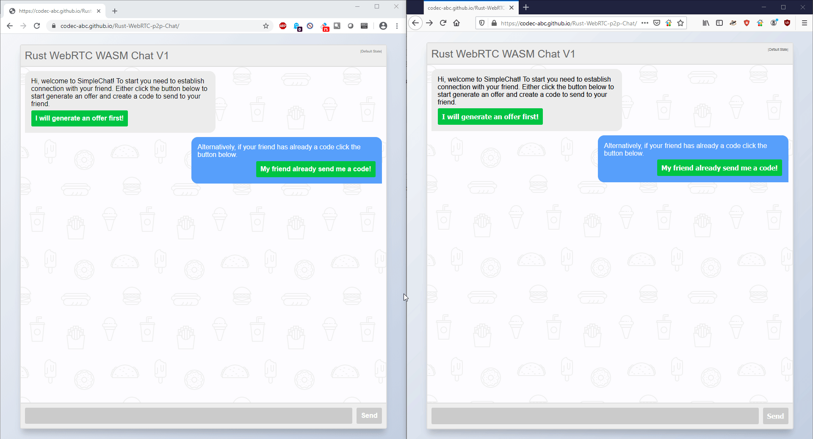

# A Yew WebRTC Chat

## About
This project showcase a simple HTML chat using WebRTC and programmed in Rust and compiled to WASM. [Live Demo](https://codec-abc.github.io/Rust-WebRTC-p2p-Chat/)

After reading this [wonderful post](https://medium.com/leaningtech/porting-a-c-multiplayer-game-to-the-web-with-cheerp-webrtc-and-firebase-29fbbc62c5ca) by the [Cheerp team](https://leaningtech.com/pages/cheerp.html)
I wanted to see if the same can be done with "pure" Rust using WASM.

Since doing a game from scratch was too complicated as a first step I aimed to just play along with Rust, HTML (using [Yew](https://github.com/yewstack/yew)) and WebRTC by doing a chat application. 3D and WebGL will come another time.

It turns out that it is not very difficult to get something working as you can see below:

## Notes
If you try to run locally prefer testing with Chrome locally because I encountered issues with Firefox. Also, be wary that some extensions might block WebRTC connections.
Also, if you are testing with a friend it might not work as I am using only a STUN server. From the tests I made, I found out that the connections are often blocked on corporate networks and using a TURN server would solve the problem. But unlike STUN server there aren't free TURN servers.
Finally, the error handling is not totally done yet as I don't know how I actually handle errors (and also what the WebRTC API allows me to do). If you are stuck reload the page on both side and try again.

## Build and Run
To build this project you need to:
1. Install wasm-pack with ``cargo install wasm-pack``
2. Install http-server ``cargo install http-server``

To run it once build you need to type
1. Compile code with ``wasm-pack build --target web --no-typescript --out-dir ./static/pkg``
2. Run web server in the ``static`` dir with ``http-server -p 8080`` (Alternatively you can use any static file server like ``python3 -m http.server``)

## Special thanks
* The [Rust](https://www.rust-lang.org/) team for making a great language
* The [Yew](https://github.com/yewstack/yew) team for making an awesome front-end framework
* [Sajad Hashemian](https://github.com/sajadhsm?tab=repositories) for making this [nice HTML chat](https://codepen.io/sajadhsm/pen/odaBdd) 